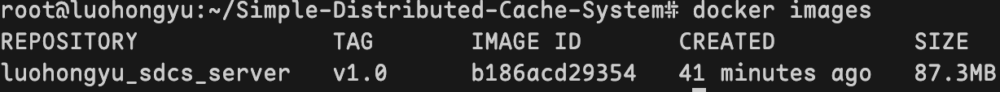
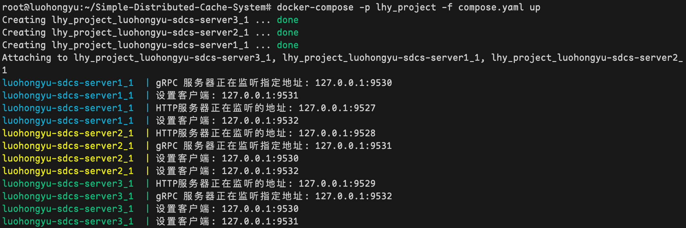
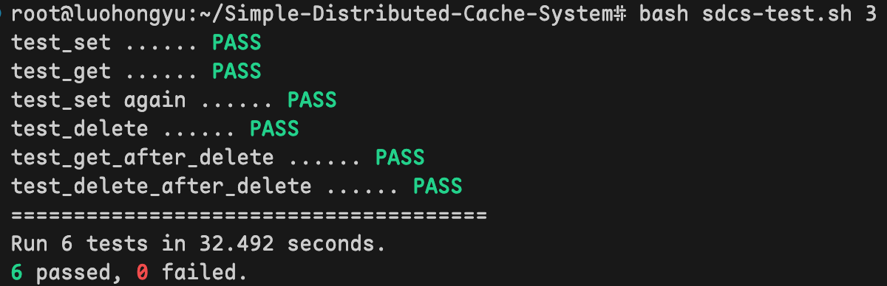
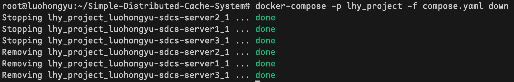
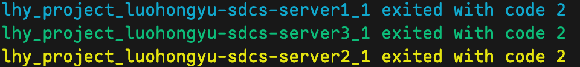

# Simple-Distributed-Cache-System
An Implementation of Distributed System Class [Assignment](https://uestc.feishu.cn/docx/C7ajdHwq9oppWXxhyelcLVvHngc).  
# RUN:  
1.进入项目所在目录
```
cd Simple-Distributed-Cache-System  
```
2.生成protoc文件  
```
protoc --go_out=. cache.proto  
protoc --go-grpc_out=. cache.proto
```  
3.编译项目
```
go build -o ./Simple-Distributed-Cache-System server.go
```  
4.分别开四个窗口执行下面四条语句  
```
./Simple-Distributed-Cache-System 1  
./Simple-Distributed-Cache-System 2  
./Simple-Distributed-Cache-System 3  
bash sdcs-test.sh 3
```

# Deploy
1.编译项目
```
go build -o ./Simple-Distributed-Cache-System server.go
```  

2.在当前目录的上级目录中寻找 Dockerfile 文件，然后使用该 Dockerfile 构建一个名为 luohongyu_sdcs_server 版本为 v1.0 的 Docker 镜像:  
```
docker build -f Dockerfile -t luohongyu_sdcs_server:v1.0 ..  
```

3.列出 Docker 镜像  
```
docker images
```  


4.使用名为 compose.yaml 的配置文件启动一个容器服务，并为该服务指定项目名称为 lhy_project:  
```
docker-compose -p lhy_project -f compose.yaml up 
``` 


5.新开一个终端运行测试脚本:  
```
bash sdcs-test.sh 3
```


6.使用名为 compose.yaml 的配置文件停止并删除一个容器服务，并为该服务指定项目名称为 lhy_project: 
``` 
docker-compose -p lhy_project -f compose.yaml down
```

